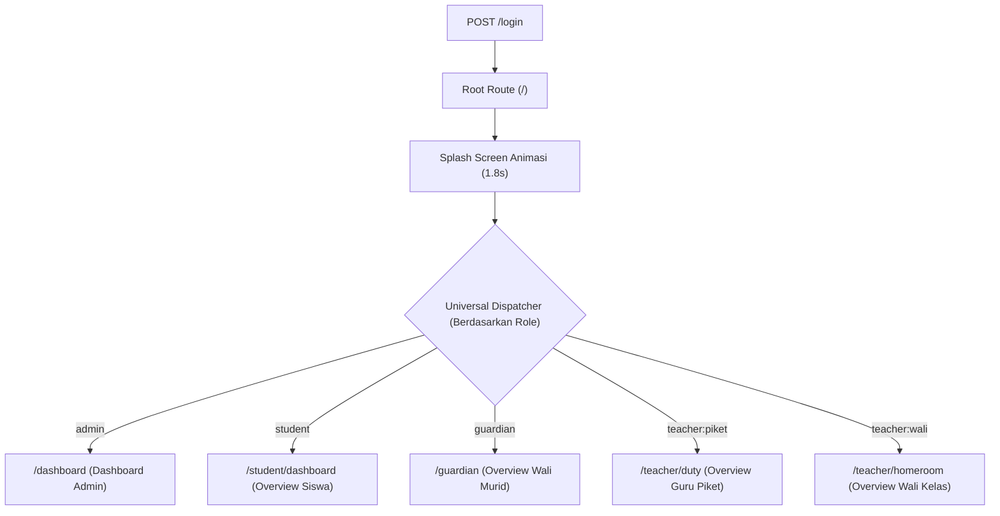

# Standar & Konvensi DX/UX: Dashboard vs. Overview
**SMART Absen — SMA UII Yogyakarta**  
*Dokumentasi Resmi Arsitektur Informasi, Konvensi Navigasi, dan Pengalaman Pengguna (DX & UX)*

---

## 1. Latar Belakang & Filosofi Semantik

Dalam perancangan sistem informasi modern tingkat enterprise dan institusi pendidikan (*SaaS / Institutional Core*), pemilihan terminologi antarmuka (*UI Label*) dan tata kelola tautan (*Routing Architecture*) memainkan peran krusial terhadap pemahaman pengguna (*Mental Model*) dan kemudahan pengembang (*Developer Experience*).

Secara tradisional, banyak aplikasi menyamaratakan seluruh halaman beranda pengguna sebagai **"Dashboard"**. Namun, terdapat distingsi mendasar antara konsep **Dashboard** dan **Overview**:

| Dimensi | Dashboard (*Dasbor Kendali*) | Overview (*Ringkasan / Beranda*) |
| :--- | :--- | :--- |
| **Definisi Semantik** | Panel kontrol agregat dengan visualisasi data makro, tren multi-periode, dan kontrol administratif tingkat tinggi. | Rangkuman status personal atau lingkup operasional terbatas harian (*daily operational summary*). |
| **Target Pengguna** | **Administrator / Manajemen Eksekutif / Kepala Sekolah** | **Siswa, Wali Murid, Guru Piket, Wali Kelas** |
| **Fokus Informasi** | Statistik seluruh sekolah (lintas tingkat kelas), grafik analitik, rasio kehadiran, dan anomali global. | "Apakah saya sudah presensi hari ini?", "Bagaimana status anak saya?", "Berapa siswa kelas saya yang hadir?". |
| **Tindakan Utama (*Primary CTA*)** | Filter periode (harian/bulanan/semester), verifikasi massal, navigasi ke data master, audit. | Tombol presensi selfie (Siswa), pengajuan izin (Wali Murid), monitoring live absensi (Guru). |
| **Karakteristik Tampilan** | Multi-widget, charts (batang/garis), selector kelas dinamis, tabel perhatian khusus institusi. | Status badge besar, greeting card personal, kalender ringkas, action banner langsung. |

---

## 2. Matriks Peran & Arsitektur Navigasi

Sistem SMART Absen menerapkan pendekatan **Hibrida Semantik**: mempertahankan `/dashboard` untuk Administrator, merapikan route dan label untuk pengguna operasional (*Overview*), serta menyediakan *Universal Gateway* yang adaptif.

### Rincian Konvensi per Peran:

| Peran (*Role*) | Route URI Backend | Named Route | Komponen Halaman React | Label Sidebar & Mobile Nav | Judul Header Halaman |
| :--- | :--- | :--- | :--- | :--- | :--- |
| **Admin** | `/dashboard` | `dashboard` | `Pages/Admin/Dashboard.tsx` | **Dashboard** | *Statistik Kehadiran Sekolah* |
| **Siswa** | `/student/dashboard` `/student/overview` | `student.dashboard` `student.overview` | `Pages/Student/Dashboard.tsx` | **Overview** | *Overview Presensi Siswa* |
| **Wali Murid** | `/guardian` | `guardian.dashboard` | `Pages/Guardian/Dashboard.tsx` | **Overview** | *Overview Presensi Anak* |
| **Guru Piket** | `/teacher/duty` | `teacher.duty` | `Pages/Teacher/DutyDashboard.tsx` | **Overview** | *Overview Guru Piket* |
| **Guru Wali Kelas** | `/teacher/homeroom` | `teacher.homeroom` | `Pages/Teacher/HomeroomDashboard.tsx` | **Overview** | *Overview Wali Kelas: [Nama Kelas]* |
| **Universal Gateway** | `/overview` | `overview` | Smart Redirect via `OverviewController` | *(Mengikuti Role)* | *(Sesuai Role Pengguna)* |

---

## 3. Tata Kelola Routing & Universal Gateway

### A. Otentikasi & Alur Masuk (*Entrypoint Flow*)
1. Pengguna melakukan login di `/login`.
2. Setelah kredensial terverifikasi, backend mengarahkan ke root route `/` (`return redirect()->intended('/');`).
3. Komponen `Welcome.tsx` mendeteksi sesi aktif dan menampilkan **Splash Screen** dengan animasi logo SMA UII dan bar pemuatan selama 1,8 detik.
4. Setelah jeda waktu selesai, `Welcome.tsx` secara otomatis memanggil `router.visit(homeHref)` yang mengarahkan pengguna ke *entrypoint* masing-masing peran.

### B. Smart Dispatcher di `/overview` & `/dashboard`
Untuk mencegah tautan putus (*broken links*), tautan tersimpan (*bookmarks*), maupun akses lintas peran:
- Route `/overview` ditangani oleh `OverviewController@index`, yang bertindak sebagai *universal traffic controller* (mengarahkan otomatis ke dashboard/overview peran masing-masing).
- Route `/dashboard` ditangani oleh `DashboardController@index`, yang melayani data admin atau mengalihkan non-admin ke beranda peran mereka.

---

## 4. Standar Pengalaman Pengembang (Developer Experience - DX)

1. **Permission Registry sebagai Single Source of Truth:**
   - Semua aturan hak akses navigasi dan perizinan route dikelola secara terpusat pada `App\Permissions\PermissionRegistry`.
   - Menambahkan menu baru atau memperbarui label antarmuka wajib melalui method `PermissionRegistry::navSections()`.
2. **Backward Compatibility:**
   - Ketika ada migrasi nama route, route lama tetap dipertahankan sebagai alias atau redirector (misal: `/student/overview` dan `/student/dashboard` keduanya valid dan berfungsi).
3. **Strict Authorization Middleware:**
   - Middleware `AuthorizeRoute` memeriksa setiap akses HTTP terhadap method `PermissionRegistry::can($user, $routeKey)`.
   - Menggunakan format granular berbasis peran dan subtipe (contoh: `admin`, `student`, `guardian`, `teacher:piket`, `teacher:wali`).

---

## 5. Standar Pengalaman Pengguna (User Experience - UX)

1. **Kejelasan Komunikasi Antarmuka:**
   - Pengguna awam (khususnya wali murid di ponsel dan siswa) tidak dibebani istilah teknis "Dashboard", melainkan "Overview" / "Ringkasan Kehadiran" yang komunikatif.
2. **Command Palette (`Ctrl + K` / `Cmd + K`):**
   - Perintah navigasi utama menyesuaikan peran yang sedang aktif:
     - Admin: *"Buka Dashboard Admin"* (Pusat kendali operasional dan analitik sekolah)
     - Siswa: *"Buka Overview Siswa"* (Ringkasan kehadiran harian dan status presensi)
     - Wali Murid: *"Buka Overview Wali Murid"* (Ringkasan kehadiran anak dan permohonan izin)
     - Guru: *"Buka Overview Guru"* (Monitoring kelas dan pemantauan absensi)
3. **Mobile Floating Bottom Navigation (Desain Kapsul Melayang & Center Action FAB):**
   - Menggunakan container melayang ber-backdrop blur (`bg-surface/95 backdrop-blur-md rounded-[28px] shadow-2xl`).
   - Tombol tengah berorientasi aksi utama (*Floating Action Button / FAB*) melayang ke atas dengan badge lingkaran solid biru institusi:
     - **Siswa:** *Home* $\vert$ **Presensi (FAB Clock Icon)** $\vert$ *Izin*
     - **Wali Murid:** *Home* $\vert$ **Ajukan Izin (FAB Plane Icon)** $\vert$ *Riwayat*
     - **Guru Piket:** *Home* $\vert$ **Pantauan (FAB Clock Icon)** $\vert$ *Rekap*
     - **Guru Wali Kelas:** *Home* $\vert$ **Verifikasi (FAB Check Icon)** $\vert$ *Rekap*
     - **Admin:** *Dashboard* $\vert$ **Data Master (FAB DB Icon)** $\vert$ *Pengaturan*
4. **Mobile Slide-out Sidebar Drawer (Panel Kartu Putih Bersih):**
   - **Header:** Logo resmi SMA UII dalam badge rounded-xl putih, judul **SMART Absen**, subtitle **SMA UII Yogyakarta**, dan tombol tutup silang (*close button*).
   - **Body:** Item navigasi vertikal dengan status aktif berwarna *soft light-blue* (`bg-primary-50 text-primary font-bold rounded-xl`).
   - **Footer:** Kartu identitas pengguna (*Avatar Circle*, Nama Lengkap, Peran/Departemen) dan tombol *Sign Out* langsung.
5. **Mobile-First Native Overview Layout (Entrypoint Seluler Per Peran):**
   - **Hero Greeting & Clock Card (`bg-primary text-white rounded-2xl`):** Menampilkan tanggal kapital formal, jam digital besar (`WIB`), sapaan personal per nama user, dan *status quick-pill badges*.
   - **Status & Primary CTA Card (`bg-surface rounded-2xl`):** Menampilkan metrik utama kehadiran (Clock-in, Clock-out/Batas, status badge) dan tombol aksi utama *full-width* (Ambil Presensi Masuk, Ajukan Izin, Verifikasi Izin Kelas, dsb.).
   - **Menu Utama Grid 2×2 (`grid grid-cols-2 gap-3`):** Kartu modular dengan ikon rounded-xl berwarna tematik (biru, amber, hijau, sky) untuk akses instan satu ketukan.

---

## 6. Protokol Pengujian & Jaminan Kualitas (*Quality Assurance*)

Setiap perubahan pada struktur route dan navigasi wajib divalidasi dengan rangkaian uji otomatis:
- `Tests\Unit\PermissionRegistryNavTest`: Memastikan item navigasi sidebar tepat 100% per peran.
- `Tests\Feature\Web\DashboardRoleTest`: Memastikan isolasi pengalihan peran di `/dashboard` dan `/overview`.
- `Tests\Feature\Web\RolePageAccessTest`: Memastikan proteksi middleware 403/302 pada halaman terlarang.
- `Vitest & Playwright`: Memastikan rendering label komponen, aksesibilitas (*axe audit*), dan responsivitas seluler.
